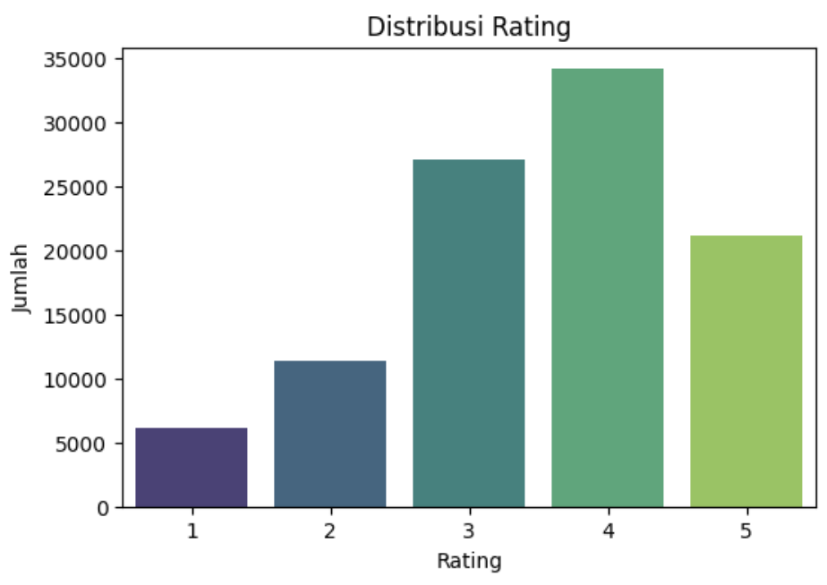
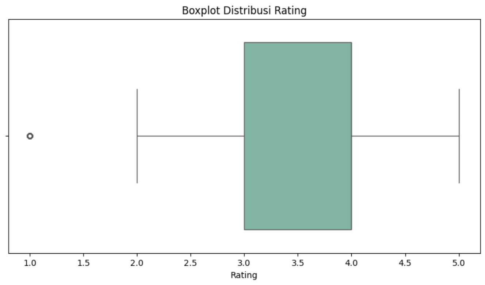
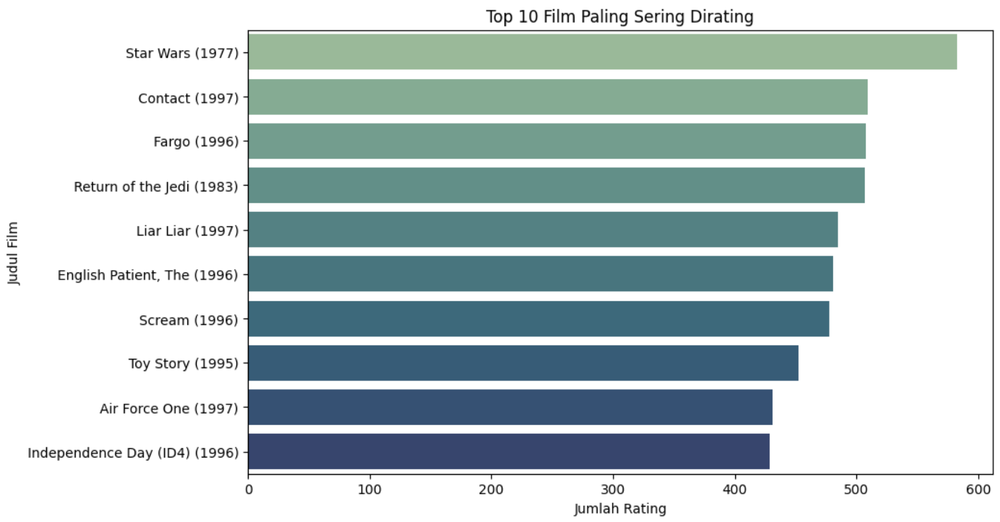
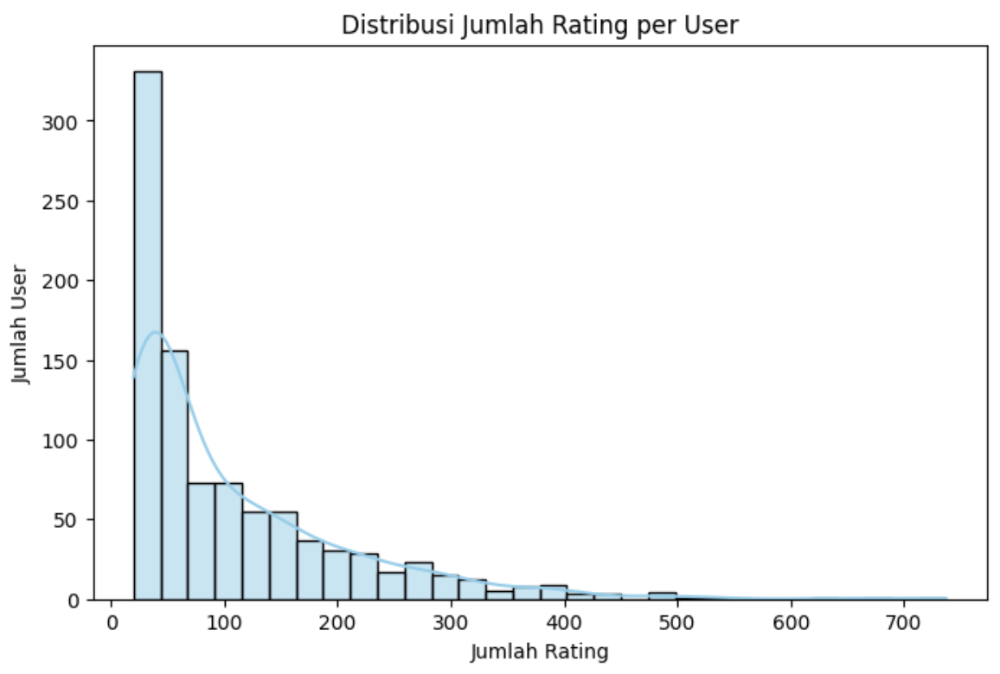
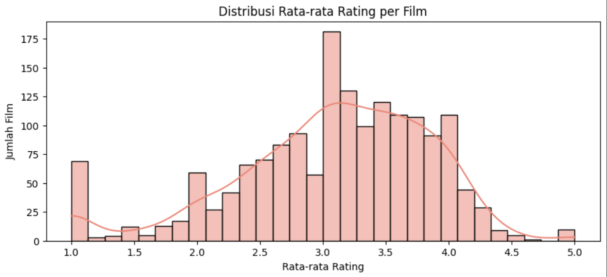
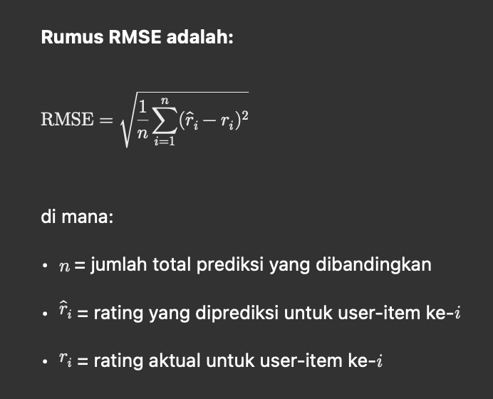
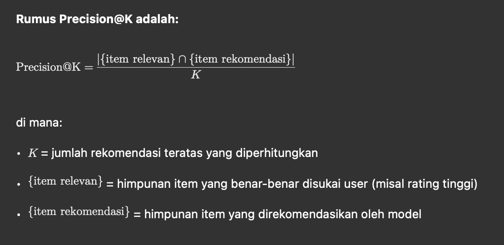

# Laporan Proyek Machine Learning - Ivan Jaelani Besti

# 1. Project Overview

## Latar Belakang

Di era digital, pengguna dihadapkan pada banyak pilihan konten film yang sangat banyak sehingga menyulitkan mereka untuk menemukan film yang sesuai dengan preferensi pribadi. Sistem rekomendasi hadir sebagai solusi untuk membantu pengguna dalam memilih film dengan memberikan rekomendasi yang relevan dan personal berdasarkan data interaksi dan konten [(Ricci, Rokach, & Shapira, 2015)](https://doi.org/10.1007/978-1-4899-7637-6).

Pengembangan sistem rekomendasi ini penting untuk meningkatkan pengalaman pengguna serta meningkatkan engagement dan kepuasan pengguna pada platform penyedia layanan film. Dengan menggunakan pendekatan content-based filtering dan collaborative filtering, sistem dapat memberikan rekomendasi yang lebih akurat dan sesuai kebutuhan pengguna [(Su & Khoshgoftaar, 2009)](https://doi.org/10.1155/2009/421425).

## Tujuan Proyek

Tujuan dari proyek ini adalah membangun sistem rekomendasi film menggunakan dua pendekatan utama, yaitu:

- Content-Based Filtering, yang memanfaatkan fitur konten film seperti genre untuk memberikan rekomendasi.
- Collaborative Filtering, yang menggunakan pola interaksi rating pengguna untuk memberikan rekomendasi.

Melalui proyek ini diharapkan dapat diketahui kelebihan dan kekurangan kedua metode serta menghasilkan rekomendasi yang efektif (Harper & Konstan, 2016).

## Referensi dan Riset Terkait

- Ricci, F., Rokach, L., & Shapira, B. (2015). *Recommender Systems Handbook*. Springer.  
  [https://doi.org/10.1007/978-1-4899-7637-6](https://doi.org/10.1007/978-1-4899-7637-6)

- Su, X., & Khoshgoftaar, T. M. (2009). A survey of collaborative filtering techniques. *Advances in Artificial Intelligence*, 2009.  
  [https://doi.org/10.1155/2009/421425](https://doi.org/10.1155/2009/421425)


# 2. Business Understanding

## Problem Statements

Pengguna platform layanan film sering kali kesulitan menemukan film yang sesuai dengan preferensi mereka karena banyaknya pilihan dan variasi konten yang tersedia. Hal ini menyebabkan pengalaman pengguna menurun dan potensi engagement yang rendah.

Selain itu, sistem rekomendasi yang ada belum mampu secara efektif menangani permasalahan seperti cold start dan keterbatasan data pengguna, sehingga rekomendasi yang diberikan kurang personal dan relevan.

## Goals

Proyek ini bertujuan untuk mengembangkan sistem rekomendasi film yang mampu memberikan rekomendasi Top-N yang relevan dan personal bagi setiap pengguna. Sistem ini harus mampu:

- Meningkatkan pengalaman pengguna dalam menemukan film yang sesuai selera.
- Mengatasi permasalahan cold start dan sparsity data dengan pendekatan yang tepat.
- Memberikan rekomendasi yang dapat dipertanggungjawabkan secara teknis dan praktis.

## Solution Approach

Dalam rangka mencapai tujuan tersebut, proyek ini menggunakan dua pendekatan utama sistem rekomendasi:

1. **Content-Based Filtering**  
   Pendekatan ini merekomendasikan film berdasarkan kesamaan fitur konten, seperti genre, yang sesuai dengan preferensi pengguna. Metode ini efektif untuk menangani cold start pada pengguna baru karena hanya membutuhkan data konten film.

2. **Collaborative Filtering**  
   Pendekatan ini menggunakan pola interaksi dan rating pengguna lain untuk memberikan rekomendasi. Metode ini dapat menangkap preferensi laten dan pola kompleks antar pengguna dan film, sehingga dapat memberikan rekomendasi yang lebih personal dan kontekstual.

Kombinasi kedua pendekatan ini diharapkan dapat saling melengkapi kekurangan masing-masing, sehingga menghasilkan sistem rekomendasi yang lebih robust dan efektif.

# 3. Data Understanding

## Deskripsi Dataset

Dataset yang digunakan dalam proyek ini adalah **MovieLens 100K**, yang merupakan salah satu dataset benchmark populer dalam pengembangan sistem rekomendasi. Dataset ini terdiri dari dua berkas utama, yaitu `u.data` dan `u.item`, yang akan dijelaskan secara terpisah berikut ini sebelum dilakukan penggabungan data.

### Dataset `u.data`

`u.data` berisi data interaksi rating dari pengguna terhadap film. Dataset ini terdiri dari 100.000 baris data yang merekam rating dari 943 pengguna terhadap 1.682 film. Setiap baris mencakup empat atribut utama, yaitu:

- `UserID`: ID unik pengguna yang memberikan rating.
- `ItemID`: ID unik film yang diberi rating.
- `Rating`: Nilai rating yang diberikan oleh pengguna, berkisar antara 1 hingga 5.
- `Timestamp`: Waktu ketika rating diberikan, dalam format UNIX timestamp.

Data ini menggambarkan preferensi eksplisit pengguna terhadap film tertentu, yang menjadi dasar bagi metode sistem rekomendasi berbasis Collaborative Filtering.

### Dataset `u.item`

`u.item` berisi metadata film yang menyediakan informasi detail tentang setiap film. Dataset ini memiliki 1.682 baris yang mewakili setiap film, dengan atribut-atribut sebagai berikut:

Kolom-kolom yang dimuat antara lain:
- `item_id`: ID film
- `title`: judul film
- `release_date`: tanggal rilis film
- `video_release_date`: tanggal rilis versi video (umumnya kosong)
- `IMDb_URL`: link film ke IMDb
- `genre_0` sampai `genre_18`: representasi genre film dalam format biner (1 berarti film memiliki genre tersebut, 0 berarti tidak)

Metadata ini berguna untuk mendukung metode Content-based Filtering dengan menganalisis fitur-fitur film yang menjadi dasar pemberian rekomendasi.

### Penggabungan Dataset

Untuk membangun sistem rekomendasi yang efektif, kedua dataset ini digabungkan berdasarkan atribut `ItemID`. Penggabungan ini memungkinkan analisis data rating pengguna yang diperkaya dengan informasi fitur film sehingga dapat digunakan dalam metode Content-based maupun Collaborative Filtering.

Dengan pemahaman yang komprehensif atas struktur dan isi dataset ini, proses data preparation dan pemodelan dapat dilakukan secara lebih terarah dan tepat sasaran.

## Sumber Dataset

Dataset dapat diunduh dari tautan berikut:  
[https://grouplens.org/datasets/movielens/100k/](https://grouplens.org/datasets/movielens/100k/)

## Fitur-Fitur dalam Dataset

- **user_id**: ID unik pengguna.
- **item_id**: ID unik film.
- **rating**: Nilai rating yang diberikan pengguna terhadap film, dalam skala 1 sampai 5.
- **timestamp**: Waktu rating diberikan (dalam format UNIX epoch).
- **title**: Judul film.
- **release_date**: Tanggal rilis film.
- **Genre (19 kolom)**: Representasi biner untuk genre film, seperti Action, Comedy, Drama, dan lain-lain. (Kolom-kolom genre ini akan digunakan perdana di tahap data preparation)

## Eksplorasi Data Awal

Dilakukan eksplorasi data untuk memahami struktur, distribusi, dan karakteristik dataset, meliputi:

- **Informasi dataset**:  
  Dataset memiliki 100.000 baris data rating dan tidak terdapat missing value pada kolom rating dan user_id.
  ```python
  print(df.info())
  ```
  ```bash
  <class 'pandas.core.frame.DataFrame'>
    Int64Index: 100000 entries, 0 to 99999
    Data columns (total 6 columns):
    #   Column        Non-Null Count   Dtype 
    ---  ------        --------------   ----- 
    0   user_id       100000 non-null  int64 
    1   item_id       100000 non-null  int64 
    2   rating        100000 non-null  int64 
    3   timestamp     100000 non-null  int64 
    4   title         100000 non-null  object
    5   release_date  99991 non-null   object
    dtypes: int64(4), object(2)
    memory usage: 5.3+ MB
    None
  ```

- **Distribusi rating**:  
  Rating didominasi nilai 3 dan 4, yang menunjukkan pengguna cenderung memberikan rating menengah ke atas.
  ```python
  print(df.describe())
  ```
  ```bash
                user_id        item_id         rating     timestamp
    count  100000.00000  100000.000000  100000.000000  1.000000e+05
    mean      462.48475     425.530130       3.529860  8.835289e+08
    std       266.61442     330.798356       1.125674  5.343856e+06
    min         1.00000       1.000000       1.000000  8.747247e+08
    25%       254.00000     175.000000       3.000000  8.794487e+08
    50%       447.00000     322.000000       4.000000  8.828269e+08
    75%       682.00000     631.000000       4.000000  8.882600e+08
    max       943.00000    1682.000000       5.000000  8.932866e+08
  ```
    - **user_id**: Terdapat 943 pengguna unik (ID dari 1 hingga 943).
    - **item_id**: Terdapat 1.682 film (ID dari 1 hingga 1682).
    - **rating**:
    - Rata-rata rating: sekitar **3.53**
    - Rating minimum: **1**, maksimum: **5**
    - Mayoritas rating berada di antara **3 dan 4**, sesuai dengan persepsi umum bahwa pengguna cenderung memberikan rating menengah ke atas.
    - **timestamp**:
    - Merupakan waktu rating dalam format UNIX timestamp.
    - Dapat dikonversi ke format waktu manusia (datetime) untuk analisis berbasis waktu (jika diperlukan).

- **Distribusi rating**:  
  

  Berdasarkan visualisasi distribusi rating, terdapat beberapa insight penting yang dapat disimpulkan:

    - **Rating 3 dan 4 mendominasi** dataset, menunjukkan bahwa sebagian besar pengguna cenderung memberikan penilaian netral hingga positif terhadap film yang mereka tonton.
    - **Rating 1 dan 2 relatif jarang diberikan**, mengindikasikan bahwa pengguna cenderung menghindari memberi rating rendah kecuali untuk film yang sangat tidak disukai.
    - **Rating 5 (tertinggi)** juga cukup umum, namun tidak sebanyak rating 4, yang mungkin mencerminkan bahwa pengguna lebih selektif saat memberikan rating maksimal.

    Distribusi ini menunjukkan adanya **bias ke arah rating tinggi**, yang perlu diperhitungkan saat membangun model evaluasi maupun saat menentukan threshold relevansi untuk metrik seperti Precision@K.

- **Visualisasi Boxplot**:
  

  Beberapa insight penting yang dapat diambil dari boxplot distribusi rating adalah:

    - **Median rating berada pada angka 4**, artinya lebih dari 50% pengguna memberikan rating minimal 4.
    - Sebagian besar rating berada pada rentang **antara 3 dan 4**, menunjukkan distribusi rating yang condong ke arah positif.
    - **Rating 1 terlihat sebagai outlier**, mengindikasikan bahwa hanya sedikit pengguna yang memberikan rating sangat rendah.
    - Tidak ditemukan outlier signifikan pada nilai rating tertinggi (5), memperkuat pola bahwa pengguna cenderung memberi rating yang baik.

    Boxplot ini memperkuat temuan sebelumnya dari histogram bahwa dataset ini memiliki **skew ke arah rating tinggi**, yang perlu dipertimbangkan dalam penyesuaian threshold relevansi maupun saat merancang sistem rekomendasi berbasis rating.

- **Top 10 film paling sering dirating**:  
  
    - Film **"Star Wars (1977)"** menempati urutan pertama sebagai film yang paling banyak dirating, menunjukkan popularitas dan daya tariknya yang tinggi di kalangan pengguna.
    - Judul-judul lain dalam daftar seperti **"Fargo (1996)"**, **"Return of the Jedi (1983)"**, dan **"Toy Story (1995)"** juga merupakan film terkenal yang dirilis pada era 1980–1990-an.
    - Semua film dalam daftar ini memiliki **lebih dari 400 rating**, mengindikasikan bahwa film-film tersebut menjadi **titik interaksi populer dalam sistem rekomendasi**.
    - Ini juga berarti bahwa film-film populer seperti ini sangat mungkin mendominasi hasil rekomendasi berbasis popularitas atau collaborative filtering jika tidak dilakukan normalisasi atau pembobotan.

- **Distribusi rating per pengguna**:
  
  - Sebagian besar pengguna memberikan **kurang dari 100 rating**, yang ditunjukkan oleh tingginya frekuensi pada bar paling kiri.
  - Hanya sebagian kecil pengguna yang sangat aktif, memberikan hingga **700+ rating**, dan mereka membentuk ekor panjang (long tail) pada distribusi.
  - Distribusi ini menunjukkan karakteristik umum dari sistem rekomendasi di dunia nyata: 
    - Terdapat banyak pengguna pasif dengan kontribusi interaksi yang minim.
    - Sebaliknya, sejumlah kecil pengguna sangat aktif dan memiliki kontribusi besar terhadap data.

- **Distribusi Rata-Rata Rating per Film** 
  
  - Rata-rata rating film cenderung mengikuti distribusi normal (bell curve) dengan puncak di sekitar **3.0 hingga 3.5**.
  - Sangat sedikit film yang memiliki rata-rata rating ekstrem, baik **sangat tinggi (di atas 4.5)** maupun **sangat rendah (di bawah 2.0)**.
  - Hal ini menunjukkan bahwa sebagian besar film memiliki penilaian moderat dari pengguna, mencerminkan penilaian yang cukup adil dan tidak bias ekstrem.
  - Keberadaan **film dengan rata-rata rating mendekati 1 atau 5** bisa menjadi indikator item yang sangat kontroversial atau sangat digemari. 

# 4. Data Preparation

Tahapan data preparation dilakukan untuk membersihkan, menyusun, dan menyiapkan data sebelum dilakukan modeling. Beberapa proses yang dilakukan meliputi penentuan kolom genre, menggabungkan data rating dengan metadata film, penghapusan kolom yang tidak relevan, dan transformasi data agar sesuai untuk pendekatan content-based filtering dan collaborative filtering.

### Langkah-langkah Data Preparation:

1. **Menentukan Kolom Genre**.
    ```python
    genre_cols = [
        'unknown', 'Action', 'Adventure', 'Animation', 'Children\'s', 'Comedy', 'Crime',
        'Documentary', 'Drama', 'Fantasy', 'Film-Noir', 'Horror', 'Musical', 'Mystery',
        'Romance', 'Sci-Fi', 'Thriller', 'War', 'Western'
    ]
    item_cols = ['item_id', 'title', 'release_date', 'video_release_date', 'IMDb_URL'] + genre_cols
    df_items = pd.read_csv('ml-100k/u.item', sep='|', encoding='latin-1', names=item_cols, usecols=range(24))
    ``` 
    Dataset `u.item` memuat 19 jenis genre dalam format biner (0/1). Untuk memudahkan proses eksplisit dan menjaga keterbacaan, kolom-kolom genre diberi nama secara manual ke dalam list `genre_cols`. File dibaca menggunakan `pandas.read_csv()` dengan separator `|`. Hanya 24 kolom pertama yang digunakan, termasuk ID film, judul, tanggal rilis, URL IMDb, dan 19 genre.

2. **Menggabungkan data rating dengan metadata film**.
    ```python
    df = pd.merge(df_ratings, df_items, on='item_id')
    ```
    Dataset `df_ratings` (interaksi pengguna) digabung dengan `df_items` (metadata film) menggunakan `item_id` sebagai primary key. Hasilnya adalah satu DataFrame (`df`) yang komprehensif.
3. **Menghapus Kolom yang Tidak Diperlukan**.
    ```python
    df.drop(columns=['timestamp', 'video_release_date', 'IMDb_URL'], inplace=True)
    ```
    Kolom `timestamp`, `video_release_date`, dan `IMDb_URL` tidak digunakan dalam proses rekomendasi sehingga dihapus agar struktur data lebih ringkas dan fokus.
4. **Membuat Content Feature Matrix** 
    ```python
    content_features = df_items.drop(columns=['release_date', 'video_release_date', 'IMDb_URL', 'title'])
    content_features = content_features.set_index('item_id')
    ```
    Data film dikonversi menjadi matriks fitur (film × genre), dengan `item_id` sebagai indeks dan kolom genre sebagai fitur. Matriks ini digunakan dalam pendekatan content-based filtering untuk menghitung kemiripan antar film.
5. **Membuat Matrix User-Item**.
    ```python
    user_item_matrix = df.pivot_table(index='user_id', columns='item_id', values='rating')
    ``` 
    Data interaksi disusun ulang menjadi pivot table (`user_id` × `item_id`) yang berisi nilai rating. Matriks ini menjadi input utama untuk pendekatan collaborative filtering (misalnya menggunakan matrix factorization).

# 5. Modeling and Result

## Sistem Rekomendasi yang Dibangun

Dalam proyek ini dikembangkan dua model sistem rekomendasi film untuk mengatasi masalah pencarian film yang relevan dan personal bagi pengguna, yaitu:

### Content-Based Filtering (CBF)

Model ini merekomendasikan film berdasarkan **kesamaan konten**. Fitur yang digunakan adalah **genre film** dalam format one-hot encoding. Kemiripan antar film dihitung menggunakan **cosine similarity**.

**Proses:**

- Setiap film direpresentasikan oleh vektor genre.
```python
genre_matrix = content_features[genre_cols]
```
- Kemiripan antar film dihitung dengan cosine similarity.
```python
cos_sim = cosine_similarity(genre_matrix)
```

**Contoh Output:**

Misalnya, untuk film *Toy Story (1995)*, rekomendasi film mirip yang dihasilkan adalah:

| item_id | title                             | similarity |
|---------|-----------------------------------|------------|
| 422     | Aladdin and the King of Thieves   | 1.000      |
| 95      | Aladdin (1992)                    | 0.860      |
| 1219    | Goofy Movie, A (1995)             | 0.860      |
| 243     | Jungle2Jungle (1997)              | 0.816      |
| 623     | Angels in the Outfield (1994)     | 0.816      |

**Kelebihan:**

- Mampu memberikan rekomendasi meskipun pengguna belum memiliki riwayat rating (cold start user).
- Transparan dan mudah dipahami karena didasarkan pada kesamaan fitur konten.

**Kekurangan:**

- Terbatas pada rekomendasi film yang mirip secara konten, sehingga kurang mampu menangkap preferensi yang lebih kompleks.
- Tidak bisa merekomendasikan film dari genre yang belum pernah ditonton pengguna.

---

### Collaborative Filtering (CF)

Model ini memanfaatkan pola interaksi rating antar pengguna dan film. Teknik yang digunakan adalah **matrix factorization** dengan **Truncated Singular Value Decomposition (SVD)**.

**Proses:**

- Matriks user-item rating di-decompose menggunakan SVD menjadi matriks laten.
```python
svd = TruncatedSVD(n_components=20, random_state=42)
latent_matrix = svd.fit_transform(user_item_filled)
```
- Matriks laten digunakan untuk merekonstruksi rating prediksi untuk item yang belum pernah dirating user.
```python
reconstructed_matrix = np.dot(latent_matrix, svd.components_)
```
- Sistem merekomendasikan film dengan prediksi rating tertinggi untuk pengguna.

**Contoh Output:**

Rekomendasi untuk user dengan ID 10:

| item_id | title                        | predicted_rating |
|---------|------------------------------|------------------|
| 514     | Annie Hall (1977)            | 4.12             |
| 187     | Godfather: Part II, The (1974) | 4.08           |
| 427     | To Kill a Mockingbird (1962) | 3.91             |
| 318     | Schindler's List (1993)      | 3.85             |
| 8       | Babe (1995)                  | 3.45             |

**Kelebihan:**

- Mampu menangkap pola preferensi laten yang kompleks antar pengguna dan film.
- Memberikan rekomendasi yang lebih personal dan beragam.

**Kekurangan:**

- Tidak mampu memberikan rekomendasi yang akurat untuk pengguna atau film baru tanpa data rating (cold start problem).
- Memerlukan data interaksi yang cukup lengkap agar model bekerja baik.

---

Kedua pendekatan memiliki keunggulan dan kelemahan masing-masing. Content-based filtering efektif untuk menangani cold start dan memberikan rekomendasi berbasis konten, sedangkan collaborative filtering mampu memberikan rekomendasi yang lebih personal berdasarkan pola interaksi pengguna.

Untuk hasil sistem rekomendasi yang optimal, pendekatan hybrid yang menggabungkan kedua metode ini direkomendasikan sebagai pengembangan lanjutan.

# 6. Evaluation

## Metrik Evaluasi yang Digunakan

Untuk mengevaluasi performa sistem rekomendasi, digunakan dua metrik utama yang sesuai dengan pendekatan yang diterapkan dan konteks data:

1. **Root Mean Square Error (RMSE)**  
   Digunakan untuk mengevaluasi model collaborative filtering dengan melihat seberapa dekat prediksi rating model terhadap rating aktual pengguna.

2. **Precision@K**  
   Digunakan untuk mengevaluasi kualitas rekomendasi content-based filtering dengan mengukur proporsi rekomendasi Top-K yang relevan bagi pengguna.

---

## Penjelasan Metrik

### 1. Root Mean Square Error (RMSE)

RMSE mengukur rata-rata kesalahan kuadrat antara nilai rating yang diprediksi dan rating aktual. Semakin kecil nilai RMSE, semakin baik performa model.

Rumus RMSE adalah:



### 2. Precision@K

Precision@K mengukur proporsi item relevan di antara K rekomendasi teratas yang diberikan kepada pengguna. Item dianggap relevan jika rating aktualnya memenuhi threshold tertentu (misalnya rating ≥ 4).

Rumus Precision@K adalah:



---

## Hasil Evaluasi

- **RMSE (Collaborative Filtering):**  
  Model menghasilkan nilai RMSE sekitar **2.13**, yang menunjukkan rata-rata selisih prediksi dan rating aktual sebesar sekitar 2 poin pada skala 1–5. Hal ini wajar mengingat sifat sparsity data dan kompleksitas preferensi pengguna.

- **Precision@5 (Content-Based Filtering):**  
  Nilai Precision@5 berkisar antara **0.20 hingga 0.40** untuk beberapa user, yang berarti sekitar 1 hingga 2 dari 5 rekomendasi teratas relevan dengan preferensi pengguna berdasarkan genre. Ini mengindikasikan rekomendasi berbasis konten memberikan hasil yang cukup baik.

---

Penggunaan RMSE dan Precision@K memberikan gambaran yang komprehensif mengenai performa sistem rekomendasi. RMSE menilai akurasi prediksi rating secara numerik, sedangkan Precision@K menilai kualitas relevansi rekomendasi pada Top-N output.

Evaluasi ini menguatkan bahwa kedua metode telah berjalan sesuai fungsi dan memberikan rekomendasi yang layak, dengan ruang untuk pengembangan lebih lanjut terutama pada penggabungan metode hybrid.

# Kesimpulan

Dalam laporan ini, evaluasi terhadap model sistem rekomendasi film menggunakan pendekatan Content-Based Filtering dan Collaborative Filtering telah menunjukkan kontribusi signifikan terhadap **Business Understanding**. Permasalahan utama, yaitu kebutuhan akan sistem rekomendasi yang mampu memberikan rekomendasi personal dan relevan bagi pengguna, berhasil diatasi dengan penerapan kedua metode tersebut.

Model yang dikembangkan dapat memberikan rekomendasi film berdasarkan preferensi pengguna secara konten maupun pola interaksi rating antar pengguna. Kedua pendekatan tersebut berhasil menjawab **problem statement** dengan menghasilkan rekomendasi yang dapat dipertanggungjawabkan dan sesuai dengan kebutuhan pengguna.

Dalam hal **solution statement**, Content-Based Filtering memberikan solusi untuk mengatasi permasalahan cold start dengan merekomendasikan film berdasarkan genre yang disukai pengguna, sedangkan Collaborative Filtering mampu menangkap preferensi laten dan memberikan rekomendasi yang lebih personal dan kontekstual. Evaluasi model menggunakan metrik RMSE dan Precision@K memastikan bahwa sistem rekomendasi yang dikembangkan tidak hanya akurat secara numerik, tetapi juga relevan secara praktis.

Secara keseluruhan, proyek ini berhasil memenuhi setiap **problem statement**, mencapai **goals** yang telah ditetapkan, dan solusi yang diterapkan memberikan dampak positif yang signifikan dalam membantu pengguna menemukan film yang sesuai dengan preferensinya. Kombinasi kedua pendekatan memiliki potensi untuk dikembangkan lebih lanjut sebagai hybrid recommender system guna meningkatkan kualitas rekomendasi.

Evaluasi ini menegaskan bahwa model yang dibuat tidak hanya akurat secara statistik, tetapi juga selaras dengan konteks masalah dan kebutuhan pengguna di dunia nyata.